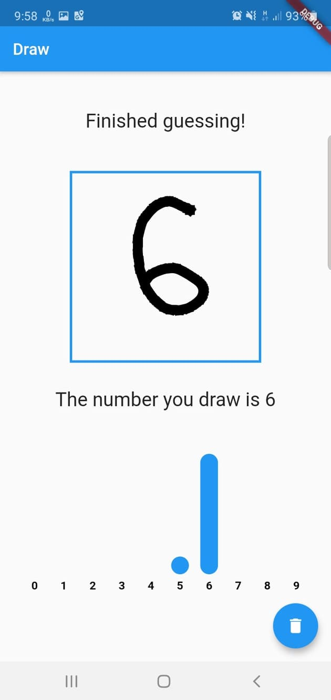
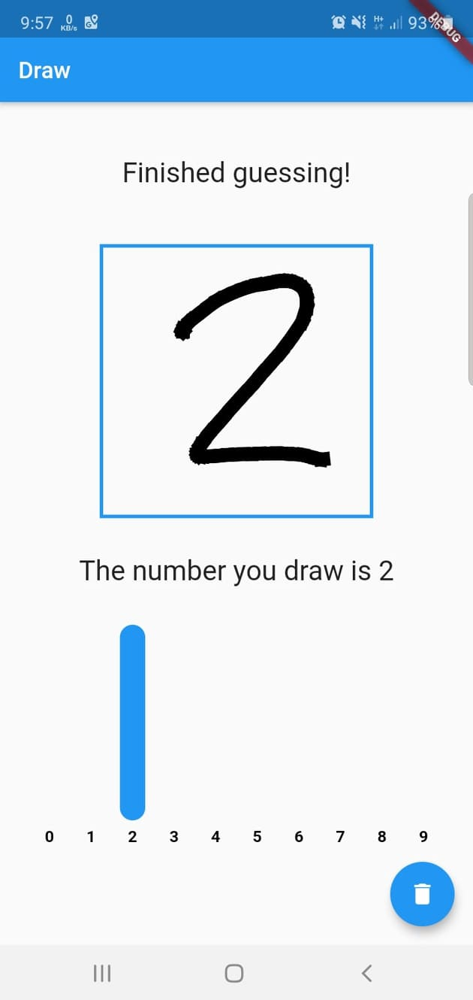

# Digit Recognizer

Learning about tensorflow and flutter through building a digit recognizer app. Followed the amazingly written tutorial by [Sergio Fraile](https://github.com/sergiofraile).

## Basic Introduction
The app lets users draw digits on to a canvas. Then it tries to predict what digit the user has drawn using machine learning.

## Features
1. Canvas for drawing digits.
2. Uses a neural network model to recognize drawn images.
3. A bar chart for showing prediction convidence values.

# Project details
1. Application UI designed using Flutter framework using Dart programming language.
2. Neural netowkr model implemented using TensorFlow framework and later converted to tensorflow light. [Model implementation can be found here](models/numbers_mnist.ipynb). Uses the following:
    * ReLU activation function.
    * Softmax classifier.
    * Adam optimizer.
3. Uses [fl_chart](https://pub.dev/packages/fl_chart) to create a bar chart for displaying prediction confidence levels.

# Preview

 
    
    

